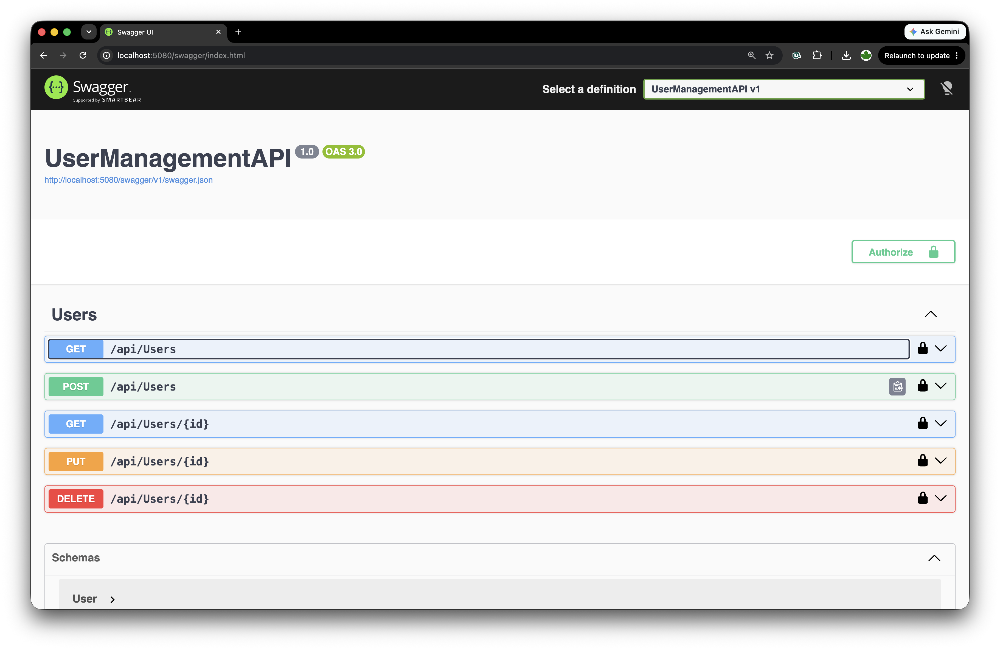
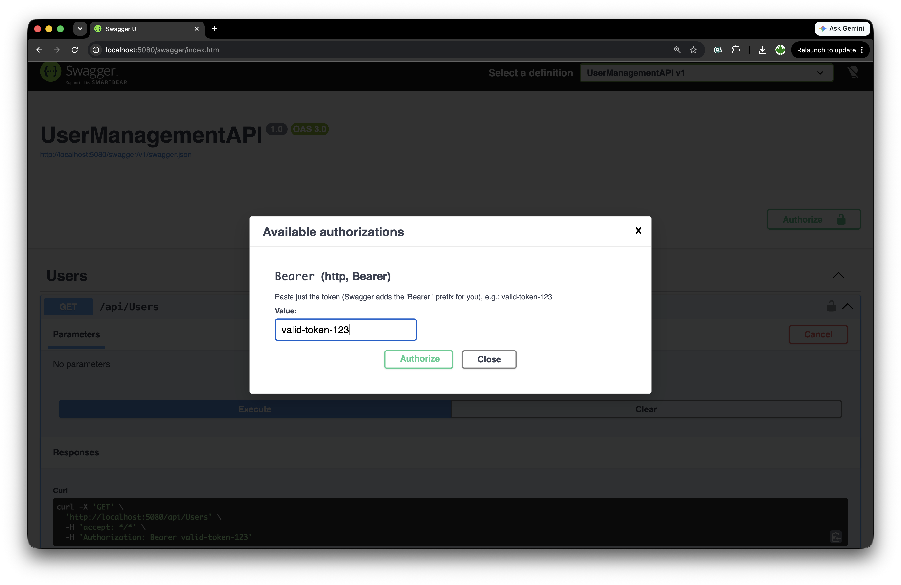

# coursera-back-end-development-dotnet




> ⭐ **If you find this repo useful or insightful, please consider giving it a star!** It helps others discover it and keeps me motivated to keep improving it. ⭐

## Assignment checklist

| Requirement | Status | Details |
|---|---|---|
| GitHub repository created | ✅ | Hosted at `github.com/ssokurenko/coursera-back-end-development-dotnet`. |
| CRUD endpoints (GET, POST, PUT, DELETE) | ✅ | Implemented in `Controllers/UsersController.cs`: `GET /api/users`, `GET /api/users/{id}`, `POST /api/users`, `PUT /api/users/{id}`, `DELETE /api/users/{id}`. |
| Used GitHub Copilot to debug | ✅ | Copilot instructions configured in `.github/copilot-instructions.md`. |
| Validation of user data | ✅ | `POST`/`PUT` in `UsersController.cs` reject missing `Name`/`Email` and invalid email format before saving. |
| Middleware implemented | ✅ | `Middleware/ErrorHandlingMiddleware.cs`, `Middleware/AuthenticationMiddleware.cs`, and `Middleware/LoggingMiddleware.cs`, registered in `Program.cs`. |


A minimal ASP.NET Core Web API for managing users, built as part of a Coursera back-end development course. It exposes CRUD endpoints for users backed by an in-memory repository, with custom middleware for logging, authentication, and centralized error handling.

## Requirements

- [.NET 10 SDK](https://dotnet.microsoft.com/download)

## Running the project

From the project root:

```bash
dotnet run
```

By default the API listens on:

- HTTP: `http://localhost:5080`
- HTTPS: `https://localhost:7037`

## Opening Swagger

With the app running in the `Development` environment (the default for `dotnet run`), open the Swagger UI in your browser at:

```
http://localhost:5080/swagger
```

Swagger provides an interactive view of all available endpoints (`GET`, `POST`, `PUT`, `DELETE` under `/api/users`) and lets you try them out directly.

## Authentication

All endpoints except `/swagger` require an `Authorization` header.

In the `Development` environment (the default for `dotnet run`), the API accepts a mock token so you can test locally without a real identity provider. Both of these are accepted:

```
Authorization: valid-token-123
Authorization: Bearer valid-token-123
```

This mock token is only accepted when running in `Development`; in any other environment it — and any other value — is rejected. Requests without a valid token receive a `401 Unauthorized` response.

To call authenticated endpoints from Swagger UI, click **Authorize** and paste `valid-token-123`.
